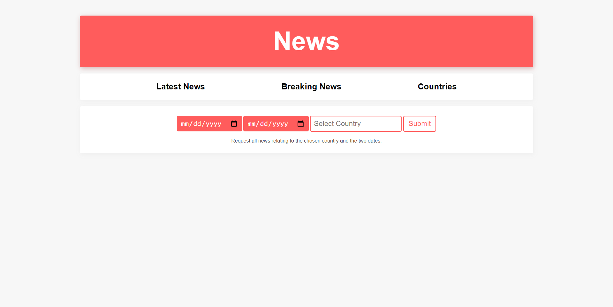

## News App | Trading Economics
This project uses the news API in the Trading Economics documentation. It shows the latest news of four countries: Mexico, Thailand, Sweden, and New Zealand. In addition, there is a "breaking news" page showing news in the past 14 days that have an importance rating of 3. Lastly, users can query for all news relating to a specific country during a specific time period. All pages are responsive.

&nbsp;

&nbsp;

&nbsp;

### Resources used:
* EJS
* CSS
* Node.js
* Express
* "tradingeconomics" npm package